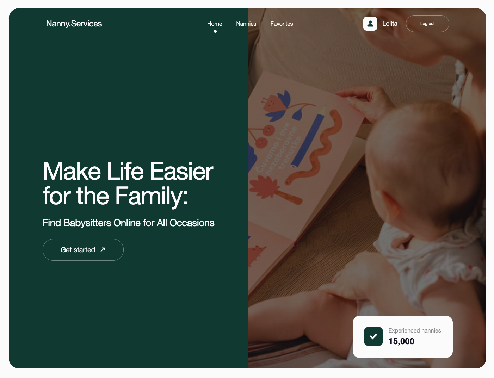

# 
Nannies.Services

    
    
    
    
    
    
    
    
    
    
    
    
    
    
    
   

## Contents

1. [Overview](#overview)
2. [Pages](#pages)
3. [Features](#features)
4. [Technologies Used](#technologies-used)
5. [Layout and Design](#layout-and-design)
6. [Technical Specification](#technical-specification)

## Overview

The <a href="https://nanny-services-app.vercel.app/">Nannies.Services</a>
project is a web application that allows users to browse nanny profiles, manage
favorites, and book appointments. The application utilizes Firebase for user
authentication and realtime database management.

 

## Pages

The application consists of 3 main pages:

1. **Home Page**: Displays the site title, company slogan, and a link to start
   using the application, which redirects to the "Nannies" page.

2. **Nannies Page**: Lists nannies that users can sort alphabetically (ascending
   A-Z or descending Z-A), filter by price, and sort by popularity (lowest to
   highest rating or vice versa).

3. **Favorites Page**: A private page where authenticated users can view nannies
   they have added to their favorites list.

## Features

- **User Authentication**

  - Registration, login, and logout functionalities using Firebase
    Authentication.
  - Secure access to user-specific data and features.

- **Registration and Login Forms**

  - Implemented with React Hook Form and Yup for minimal field validation.

- **Realtime Database**

  - Firebase Realtime Database used to store nanny profiles.

- **Nannies Page**

  - Displays initial 3 nanny cards.
  - "Load more" button fetches additional nanny profiles from the database upon
    click.

- **Nanny Profile Card**

  - Designed according to the layout with detailed characteristics of each
    nanny.
  - Expandable feature: clicking "Read more" displays additional information and
    reviews from parents.

- **Favorites Management**

  - Non-logged-in users prompted to log in when adding a nanny to favorites.
  - Logged-in users can add nannies to favorites.
  - Favorites persist using localStorage.

- **Favorites Page**

  - Accessible to authenticated users, displaying all nannies added to
    favorites.

- **Appointment Booking**

  - "Make an appointment" button opens a modal window with a form for scheduling
    a meeting with a nanny.
  - Form validation: handled by React Hook Form and Yup.

- **Modal windows**
  - Modal window closes on clicking the close button, backdrop, or pressing the
    Esc key.

## Technologies Used

- **React**
- **React Router**
- **Redux Toolkit & Redux Persist**
- **Firebase**
- **REST**
- **Axios**
- **React Hook Form & Yup**
- **Ant Design**
- **React Select**
- **Framer Motion**
- **React Loader Spinner**
- **React Toastify**
- **React Toastify**

## Layout and Design

The application layout is responsive, ranging from 320px to 1440px width,
ensuring compatibility across mobile, tablet, and desktop devices. Semantic HTML
is used for accessibility and SEO optimization.

<a href="https://www.figma.com/file/u36ajEOsnwio2GDGiabVPD/Nanny-Sevices?type=design&node-id=0-1&mode=design&t=CZpMnnOCRwAYc81O-0">Layout
</a>

## Technical Specification

<a href="https://docs.google.com/document/d/19ugM1gvOw81nCyALr4EZs3dmv6OfJm94VjupcytbnJY/edit">Technical
Specification</a>
